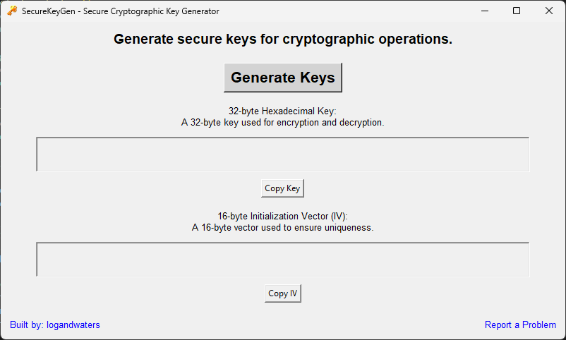
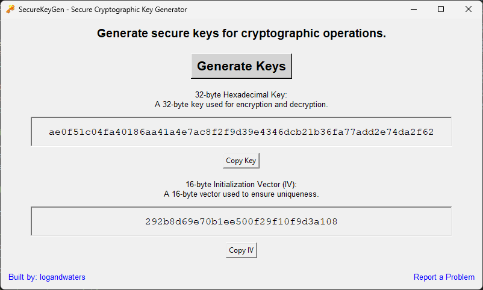

# Crypto Key Generator

The Crypto Key Generator is a lightweight and secure application that generates cryptographic keys and initialization vectors (IVs) locally on your device. It does not log any interactions, ensuring user privacy and security. Built using the Tkinter framework, the app provides a user-friendly interface for generating keys suitable for encryption and decryption tasks in various applications.

### Main Screen

## Key Features
- **Local Generation:** Keys are generated using the `secrets` library, which provides strong random number generation suitable for cryptographic use. The application does not log any user interactions, ensuring that your key generation process remains private.
- **User-Friendly Interface:** Built with the Tkinter framework, the application offers a clean and intuitive interface that allows users to generate keys effortlessly.
- **Versatile Use Cases:**
  - **Encryption and Decryption:** Ideal for software developers and security professionals needing secure keys for encrypting sensitive data.
  - **Secure Communications:** Useful for creating keys for secure messaging applications.
  - **Data Protection:** Helps in protecting sensitive information stored in databases or files.

## Framework
The app leverages **Tkinter**, a standard GUI toolkit in Python, allowing for the creation of cross-platform applications. Tkinter is known for its simplicity and effectiveness in developing desktop applications quickly.

## Security Assurance
The Crypto Key Generator prioritizes user security. By running the application locally, it eliminates the risks associated with cloud-based key generation, such as unauthorized access and data breaches.

## Additional Notes
- **No Internet Required:** The app functions completely offline, making it a great choice for environments with strict security protocols.
- **Cross-Platform Compatibility:** Being built with Python and Tkinter, the application is compatible with various operating systems, including Windows, macOS, and Linux.

By using the Crypto Key Generator, users can confidently generate the keys they need while ensuring that their cryptographic practices remain secure and private.

## Installation

1. Download the `securekeygen.exe` file from the [Releases](https://github.com/logandwaters/securekeygen/releases) section of this repository.
2. Ensure you have the necessary permissions to run executables on your machine.

## Instructions to Use the Application

1. **Run the Application**:
   - Double-click the `securekeygen.exe` file to launch the application. 

2. **Generate the Key**:
   - Click on the "Generate Key" button to create the keys.

3. **Copy or Save the Key**:
   - Once the key is generated, you will see it displayed on the screen.
   - You can either copy the key to your clipboard or save it to a file as needed.

4. **Exit the Application**:
   - Once you are done, you can close the application by simply closing the window.

### Example Key Generation

## Contributing

Contributions are welcome! Please feel free to open issues or submit pull requests.

## License

This project is licensed under the MIT License - see the [LICENSE](LICENSE) file for details.
